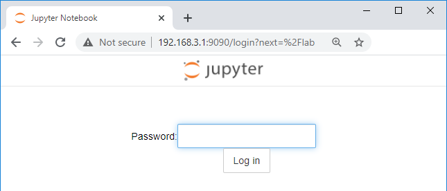

# Getting started with your AUP-ZU3

This guide will show you how to setup your computer and AUP-ZU3 board using PYNQ. 

### Prerequisites

* AUP-ZU3 board
* Micro SD card (16 GB or more recommended)
* 1x USB-C to USB-C for power, and suitable power source
* For connection to board:
  * 1x USB-C to USB-C for USB gadget or
  * USB Ethernet adaptor, or Wifi dongle (either USB-C or with USB-C adapeter to connect to the board)
* Optional: USB-C cable (for serial terminal)

## Setup video

You can watch the getting started video guide, or follow the instructions below.

<iframe class="vid" src="https://www.youtube.com/embed/KBIjj6F7lvA" frameborder="0" allow="accelerometer; autoplay; clipboard-write; encrypted-media; gyroscope; picture-in-picture" allowfullscreen></iframe>

## Setup instructions

### Prepare a Micro SD card

* Download the [AUP-ZU3 v3.1 PYNQ image](http://www.pynq.io/boards.html) and write the image to a Micro SD card

### Setup the board

1. Set the *BOOT* switch to the **SD** position to boot from the SD card

2. Insert the Micro SD card (pre-loaded with the PYNQ AUP-ZU3 image) 

3. Use a USB-C cable to connect the board to your computer

4. Connect another USB-C cable from the board to a power source. This can be:

  * A USB-C power adapter that can provide 9V @ 3A, or

  * A USB-C port on your laptop or PC (make sure it can provide enough power)

### PYNQ Boot sequence

After you setup and power on the board, you should see the following sequence represented in the animated image, and described below.

1. Power LEDs will turn on. Check the the **ON** LED turns on. You will also see the two PS LEDs (PS LED0, PS LED1) turn on, and PS LED1 flash in a "heartbeat" pattern. This is a good indication the board is alive and the boot is in progress. 
2. After about 30-60 seconds, you should see the **DONE** LED turn on. This is the FPGA done signal, and indicates a bitstream has been downloaded. 
3. A few seconds later, the PYNQ image will flash the 8 white *user LEDs* (LD0-LD7), and the 4 RGB LEDs (RGB0-RGB3) will flash alternating colours to indicate the board is ready.

See the [Troubleshooting section](./support.md#troubleshooting) for issues.

#### Connect to the board

* On your computer, open a web browser (Chrome/Safari/Firefox [check Jupyter Notebook supported browsers](https://jupyter-notebook.readthedocs.io/en/stable/notebook.html#browser-compatibility)), and browse to [http://192.168.3.1/lab](http://192.168.3.1/lab) if you are using Ethernet Gadget.

This should bring you to the Jupyter log in screen.

​	

* Enter **xilinx** as the password

This should bring you to the Jupyter home area where you can start to explore your board with the getting started notebooks. 

 	

---------------------------------------

Copyright&copy; 2025 Advanced Micro Devices

