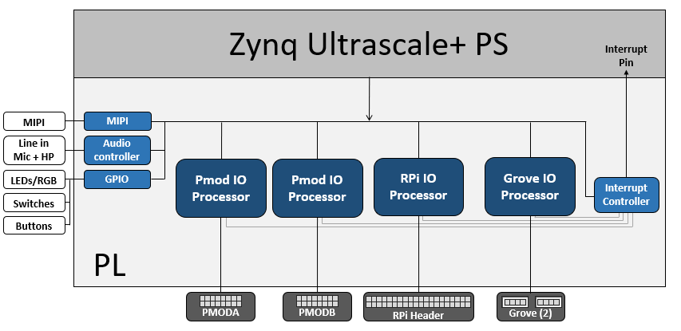
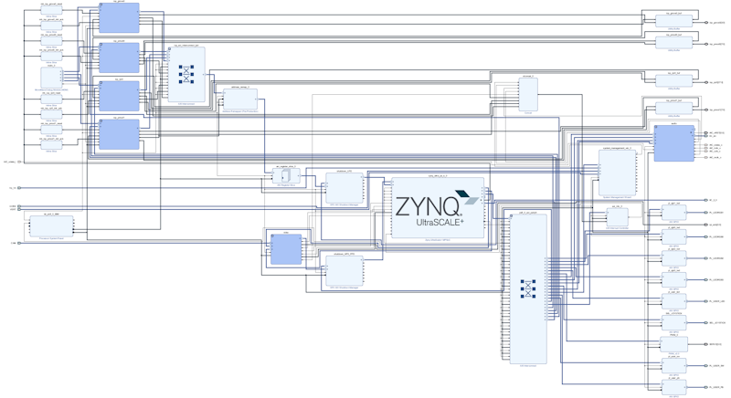

# AUP-ZU3 Base overlay

The `base` overlay is included in the PYNQ image for the AUP-ZU3 board. The purpose of the base overlay design is to allow PYNQ to use peripherals on a
board out-of-the-box. The design includes hardware IP to control peripherals on 
the target board, and connects these IP blocks to the Zynq PS. 

## AUP-ZU3 Block Diagram



The base overlay on AUP-ZU3 includes IP to connect to the following hardware:

* MIPI IP 
* Audio codec
* User LEDs, Switches, Pushbuttons
* 2x Pmod PYNQ MicroBlaze
* RPi (Raspberry Pi) PYNQ MicroBlaze


Note that the Mini DisplayPort is connected to the PS, and is not directly part of the *base* overlay as it is accessed through the PS. 

## Video 

Example notebooks are included in the `<Jupyter Dashboard>/base/video` directory on the board and show how to use the PS Mini-DisplayPort and MIPI interfaces. 

### HDMI

The PYNQ-ZU has dual-stacked HDMI in and HDMI out ports. The HDMI interfaces are connected to a HDMI PHY that supports up to 4K resolutions. 

The HDMI IP is connected to PS DRAM. Video can be streamed from the HDMI *in* to memory, and from memory to HDMI *out*. This allows processing of
video data from python, or writing an image or Video stream from Python to the HDMI out.

Note that while Jupyter notebook supports embedded video, video captured from the HDMI will be in raw format and would not be suitable for playback in a notebook without appropriate encoding.

### MIPI

The AUP-ZU3 has a MIPI (Mobile Industry Processor Interface) CSI (Camera Serial Interface) which is connected to a MIPI subsystem in the base overlay. 

### DisplayPort

The AUP-ZU3 has a DisplayPort output which is connected to the PS which means that it is always available. It is not part of the *Base* overlay, but it can be used with the other interfaces and IP that are in the base overlay. 

## Audio

The AUP-ZU3 base overlay supports line in, and Headphones out/Mic. The audio
source can be selected, either line-in or Mic. 

## User IO

The AUP-ZU3 board includes four tri-color LEDs, 8 switches, 4 user push buttons connected to the PL (BTN0-BTN3), and 8 (white) user LEDs (LED0-LED3). These IO are connected directly to Programmable Logic pins. 

### IOPs

For more information see the [PYNQ IOP documentation](https://pynq.readthedocs.io/en/latest/pynq_libraries.html#pynq-iops) and the [PYNQ MicroBlaze documentation](https://pynq.readthedocs.io/en/latest/pynq_libraries.html#pynqmicroblaze).

## Python API

The Python API for the peripherals in the base overlay is covered in 
[pynq libraries](https://pynq.readthedocs.io/en/latest/pynq_libraries.html). Example notebooks are also provided on the board to show how to use the base overlay.

## Rebuild the base overlay

The following steps describe how to rebuild the *base* overlay. You need to use *Vivado 2024.1* to run these steps. You may need to update the Tcl scripts to work with other versions of Vivado. As the precompiled design is already available in the PYNQ image for the board, you only need to do this if you want to study the design, or make a modification.

### Get the source code

* Download or clone a copy of this repository

### Add AUP-ZU3 board files to Vivado

Run the following Tcl commands in Vivado to download the latest  board files from the Xilinx board repository:

```console
xhub::refresh_catalog [xhub::get_xstores xilinx_board_store]
xhub::install [xhub::get_xitems "realdigital:xilinx_board_store:aup-zu3:1.1"]
```

## Build the HLS IP and the create the project

Some IP for the base design are provided as HLS files. The source is available in this repository. A Tcl script is provided to compile the source files (using Vivado HLS) and export them in IP-XACT format so that they can be used in Vivado.

* Open Vivado, change (`cd`) into the `base` directory, and run the following commands in this order to build the HLS IP, and to create a Vivado project and build the block diagram for the base overlay:

```console
source ./build_ip.tcl
source ./base.tcl
```

The first command builds HLS IP for this design, and the second command builds the IP Integrator system diagram for the base overlay. 

The base overlay is a complicated design with a large number of IP blocks. The image below shows a view of the base design. You can click on this image to see a PDF version of the block design. This picture is only intending to show you a top level view of the level of complexity in the design, and not the detail of every IP. If you would like to explore the design in more detail, you can rebuild the design to this point, and check individual IP, and open various IP subsystems. 

[](./pdf/aup_zu3_base_overlay.pdf)

You can run the following commands to rebuilt the bitstream.
```
source ./build_bitstream.tcl
```

You can now review the block diagram.

Remember the precompiled bitstream is already loaded on your board, so you do not need to rebuild the bitstream unless you have changed something in the design. 

---------------------------------------
<p class="copyright">Copyright&copy; 2025 Advanced Micro Devices</p>