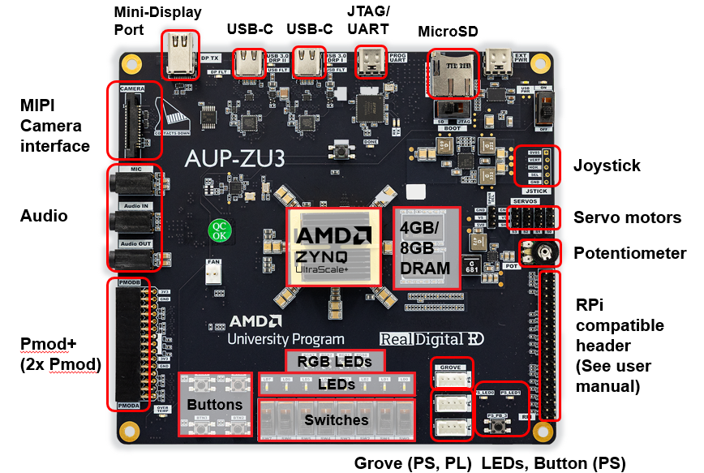
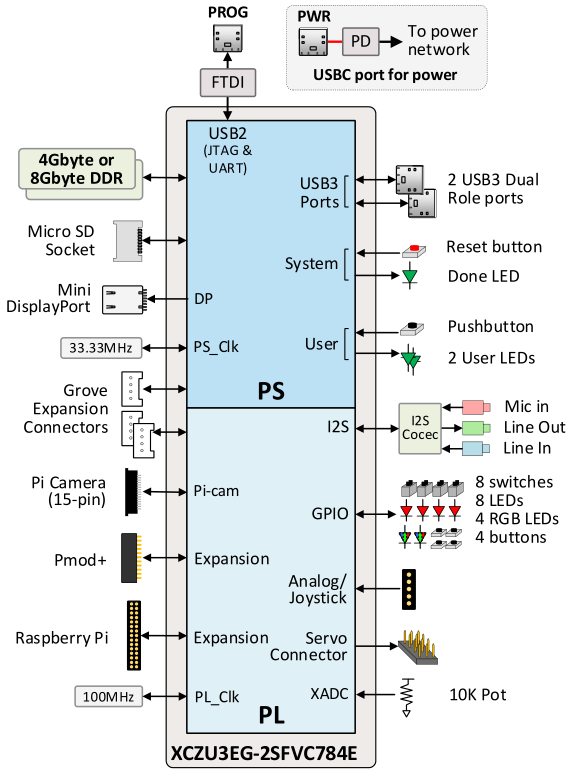

# Board overview

The board has the following features and interface:

* Zynq Ultrascale+ XCZU3EG
* 4GB or 8GB DDR4
* Mini Display port
* MIPY camera interface
* USB-C power in
* 2x USB-C 3.0 Host/OTG
* 1x USB-C JTAG/UART
* Audio codec
* 40-pin Raspberry Pi connector, 3x Grove (1x PS, 2x PL)
* 1x Pmod+ (2x Pmod)
* 8x White user LEDs
* 8x Slide switches
* 4x User pushbuttons
* 4x RGB LEDs   
* 2x Green user LEDs (PS)
* 10k Potentiometer

## AUP-ZU3 board features and interfaces

## Block Diagram

## PS/PL connections

### Zynq UltraScale+ MPSoC device

The AUP-ZU3 has a Zynq Ultrascale+ XCZU3EG-2SFVC784E with an ARM Cortex A53 quad-core Processing System (PS) and Ultrascale+ Programmable Logic (PL).

This device has the following resources:

| System Logic Cells (K) | 154 |
|-|-|
| __CLB Flip-Flops (K)__ | __141__ |
| __CLB LUTs (K)__ | __71__ |
| __Total Block RAM (Mb)__ | __7.6__ |
| __DSP Slices__ | __360__ |

Peripherals are connected to PS and PL as follows:

### PS connected

* 4GB or 8GB DDR4 depending on board variant
* Micro SD card port
* Mini Display port
* WiFi + Bluetooth
* 2x 2-Stacked USB 3.0 hub
* USB 3.0  Composite device (Micro USB 3.0 port)
* TPM Pmod
* I2C/PMBus
* UART
* Grove (1)

### PL connected

* HDMI In and HDMI Out
* Audio codec
* FMC LPC
* Dual SYZYGY interfaces
* 40-pin Raspberry Pi connector
* Grove (2)
* Pmod (2)
* CSI
* XADC
* 4x Switches, 4x User pushbuttons, 4x LEDs, 2x RGB LEDs   

---------------------------------------

Copyright&copy; 2025 Advanced Micro Devices
